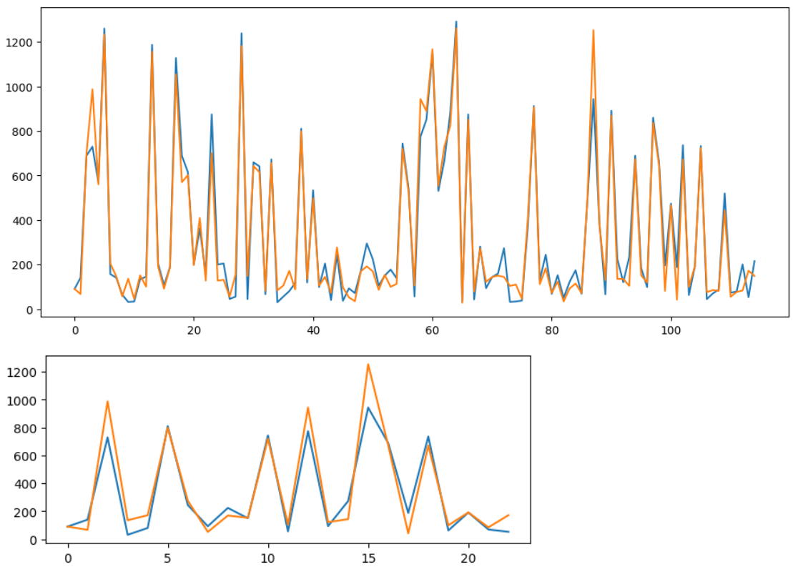

# Prediction and Map
huff_and_map.py - код функций для расчета Хаффа и для генерации карты по координатам

model_prediction.py - код функции, которая по площади и координатам выводит ожидаемый поток покупателей в день с помощью нейронной сети на PyTorch
#
Модель для предсказания потока покупателей в день:

model_nn.ipynb - код обучения модели на PyTorch; model - сохраненные параметры
# 
Были проанализированы результаты рабты линейных моделей и RandomForest из библиотеки sklearn,
модели на основе градиентного бустинга из библиотек CatBoost и XGBoost,
а также нейроная сеть на PyTorch.

Наилучшие результаты показала нейронная сеть на PyTorch, состоящая из 3 линейных слоёв и 2 слоёв активации.
# Графики
Результаты работы итоговой модели: сверху на всем датасете, снизу на тестовой выборке.

Синяя линия - реальные данные, оранжевая линия - предсказания модели.

(ось x - номер магазина, ось y - поток покупателей)

